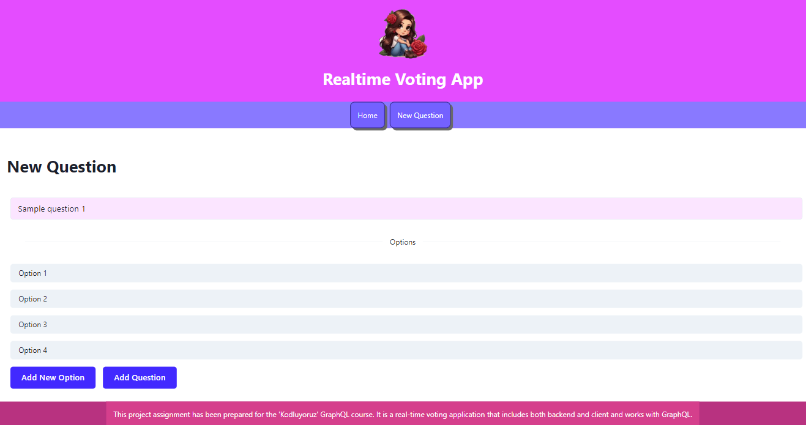

# GraphQL Realtime Voting App :hibiscus::gem:

This project assignment has been prepared for the 'Kodluyoruz' GraphQL course. It is a **real-time** voting application that includes both **backend** and **client** and works with **GraphQL**.

---

## Used :sparkles:
Chakra UI, AntDesign, GraphqlYoga, ApolloClient, BabelCli for ES6, React Router Dom GraphQL Subscriptions

---

---

---

---

